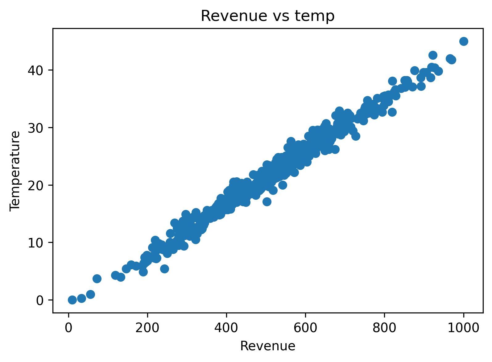
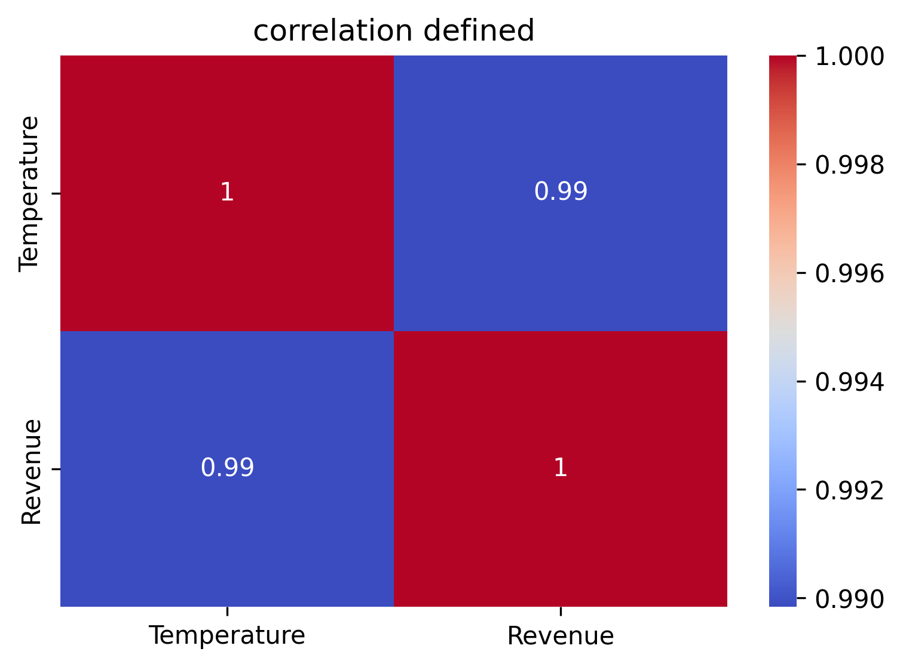
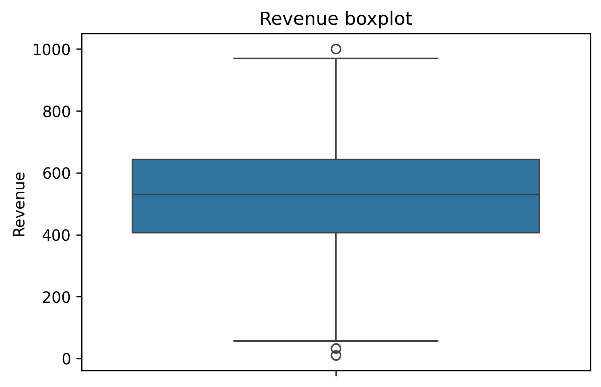
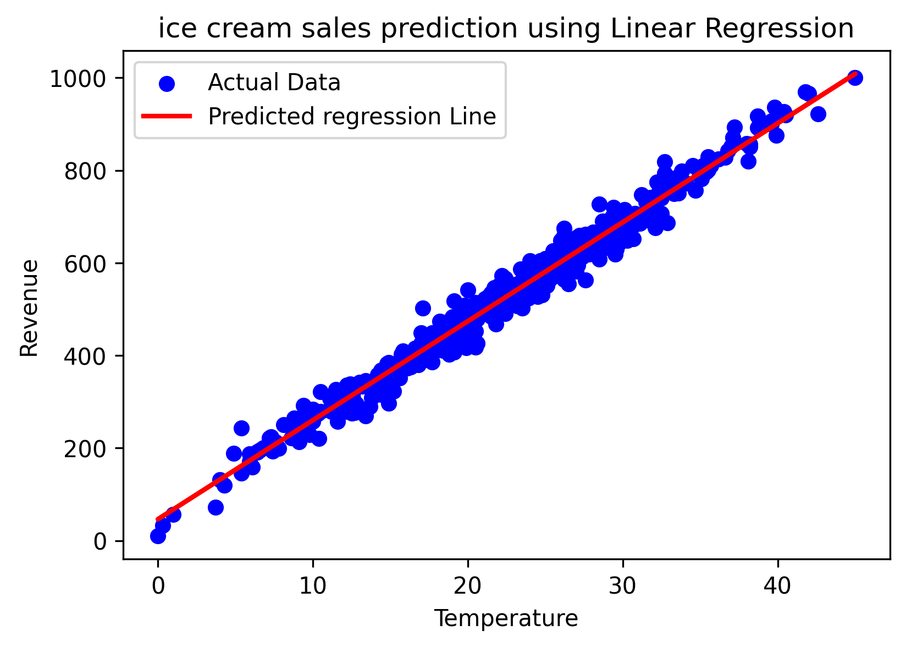

# 🍦 Ice Cream Sales Prediction using Simple Linear Regression

## 📌 Project Overview

This project predicts ice cream sales (revenue) based on temperature using **Simple Linear Regression**. It demonstrates a complete machine learning workflow from data loading and exploratory data analysis to model training, evaluation, and visualization.

---

## 🎯 Problem Statement

Build a machine learning model that predicts ice cream revenue based on temperature.

---

## 🛠️ Technologies Used

- Python
- Pandas
- NumPy
- Matplotlib
- Seaborn
- Scikit-learn
- Google Colab

---

## 📂 Project Workflow

1. Data Loading
2. Exploratory Data Analysis (EDA)
3. Data Preprocessing
4. Train-Test Split
5. Model Training
6. Prediction
7. Model Evaluation
8. Visualization

---

## 📊 Project Visualizations

### Scatter Plot

### Correlation Heatmap

### Box plot

### regression line
.png)

### Regression Line

---

## 📈 Evaluation Metrics

- Mean Absolute Error (MAE)
- Mean Squared Error (MSE)
- Root Mean Squared Error (RMSE)
- R² Score

---
